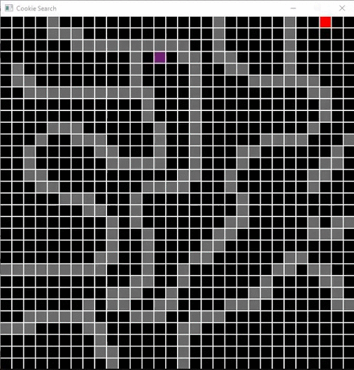

# CookieSearch
Visual pathfinding demo written in C++ using SDL

# How to Build
Simply clone the repo on your computer and open up the .sln file; make sure to set the solution platform to x64.

# Controls
Click and drag your mouse button to create grey walls. When you're done building the level, press SPACE to begin pathfinding

# Technical Info
Currently Cookie Search is using an implementation of Dijkstra's Algorithm, which uses BFS and a priority queue to find the path. I
plan on adding different pathfinding methods so the user can compare them against each other.
